layout:true

<p class="footer">
<span xmlns:dct="http://purl.org/dc/terms/" property="dct:title">Web Mapping for Preservationists</span> by <a xmlns:cc="http://creativecommons.org/ns#" href="http://www.datapolitan.com" property="cc:attributionName" rel="cc:attributionURL">Richard Dunks</a> is licensed under a <a rel="license" href="http://creativecommons.org/licenses/by-sa/4.0/">Creative Commons Attribution-ShareAlike 4.0 International License</a>.<a rel="license" href="http://creativecommons.org/licenses/by-sa/4.0/"></a>
</p>

---

class: center


- - -
# Web Mapping for Preservationists
## Richard Dunks
## Follow along at: http://bit.ly/cu-preservation-mapping
### See the code at: http://bit.ly/cu-mapping-preservation-code

---

# Introductions
+ Name
+ Concentation
+ One thing you hope to get out of the lecture tonight

---

# Goals for this evening
--

+ Review map types
--

+ Survey GIS/mapping tools
--

+ Describe open-source and proprietary software
--

+ Demonstrate creating an online, interactive web map using open data


---

class: center, middle
# Why Do We Create Maps?

---

# Thematic Maps

--

+ Focuses on a specific theme or subject area
--

+ Features on the map represent the phenomenon being mapped
--

+ Spatial features used for reference
---

##### Source: http://www.usna.usda.gov/Hardzone/ushzmap.html 

---

# Dorling Cartogram – Obesity by State

##### Source: http://homes.cs.washington.edu/~jheer//files/zoo/ 

---

# General Reference Maps

--

+ Show important physical features of an area
--

+ Include natural and man-made features
--

+ Usually meant to help aid in the navigation or discovery of locations
--

+ Usually fairly simple
--

+ Can be stylized based on the intended audience (tourists vs locals)

---


---

# The Tools

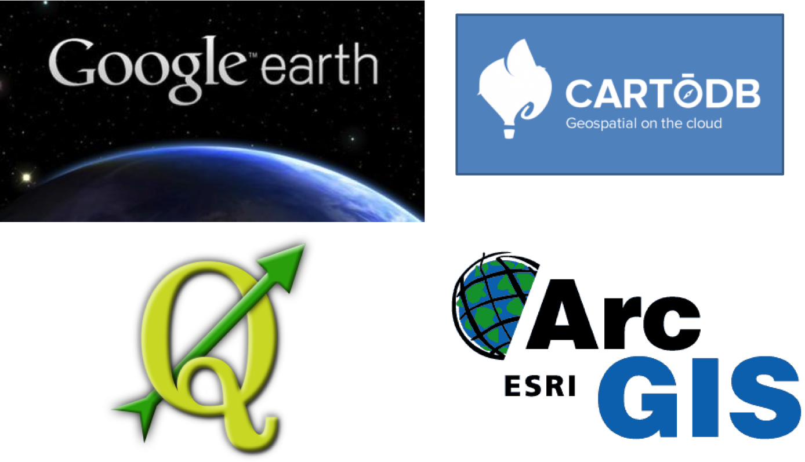

---

# ArcGIS

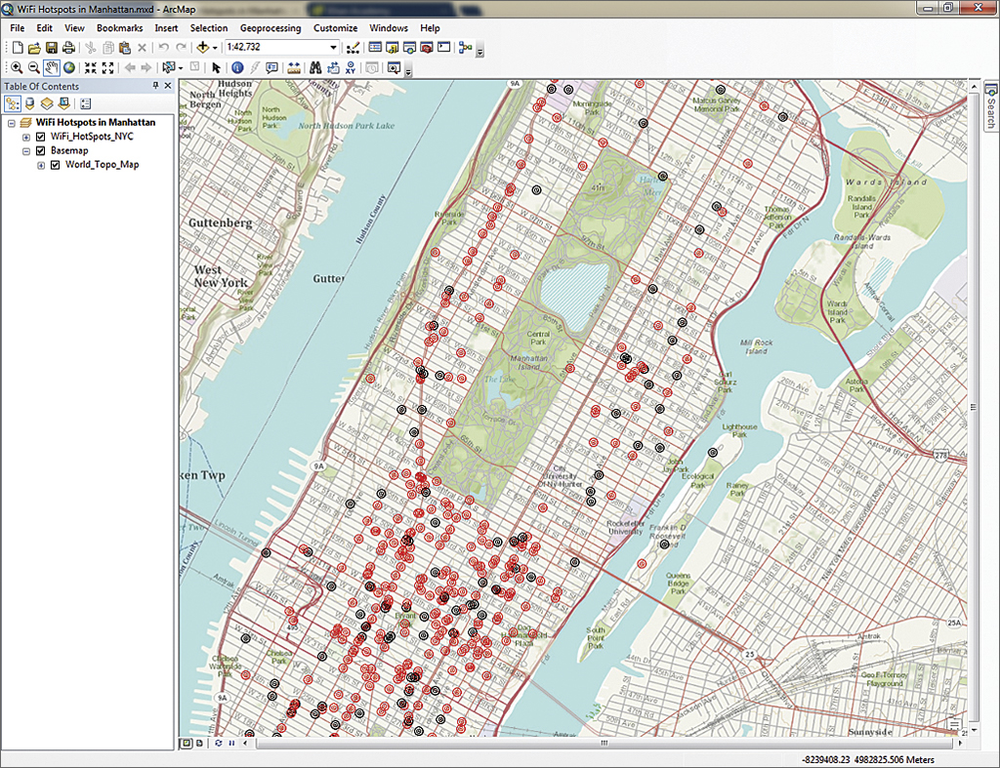
[Source](http://www.esri.com/news/arcuser/1012/a-workflow-for-creating-and-sharing-maps.html)

---

# Google Earth


---

# Google Fusion Tables
<iframe width="100%" height="430" scrolling="no" frameborder="no" src="https://www.google.com/fusiontables/embedviz?q=select+col54%2C+col55+from+1dNtdy7FuBBZ2qTxX7jgZ5Dig8n96oxRrWFjuhYpJ+where+col3+%3E%3D+0+and+col3+%3C%3D+4+and+col26+%3D+2+limit+1000&amp;viz=HEATMAP&amp;h=true&amp;lat=40.844685&amp;lng=-73.915349&amp;t=1&amp;z=12&amp;l=col54&amp;y=2&amp;tmplt=2&amp;hmd=true&amp;hmg=%2366ff0000%2C%2393ff00ff%2C%23c1ff00ff%2C%23eeff00ff%2C%23f4e300ff%2C%23f4e300ff%2C%23f9c600ff%2C%23ffaa00ff%2C%23ff7100ff%2C%23ff3900ff%2C%23ff0000ff&amp;hmo=0.6&amp;hmr=26&amp;hmw=0&amp;hml=TWO_COL_LAT_LNG"></iframe>
Source: [NYC Open Data 311 Noise Complaints, 1 Jan - 20 May 2014, Between Midnight and 4 am in the Bronx](https://www.google.com/fusiontables/DataSource?docid=1dNtdy7FuBBZ2qTxX7jgZ5Dig8n96oxRrWFjuhYpJ#map:id=3)

---

class:center,middle
# Proprietary vs Open-Source

---

# What is open-source?


Source: https://www.apertus.org/opensource <a rel="license" href="http://creativecommons.org/licenses/by/3.0/"></a><br />This work is licensed under a <a rel="license" href="http://creativecommons.org/licenses/by/3.0/">Creative Commons Attribution 3.0 Unported License</a>.

---

# What is open-source?
--

+ Free to download
--

+ Free to use
--

+ Able to change and customize
--

+ Usually no enterprise support
--

+ Supported by a community

--

[](http://michaelminn.com/)

---

# Proprietary software
--

+ Pay to download
--

+ Pay to use (usually with a license)
--

+ Not able to change or customize (legally)
--

+ Usually supported by a team of paid developers

---

class:center,middle
# How does this affect you?

---

class:center,middle
# Examples of Open Source Mapping Software

---

# [QGIS](http://www.qgis.org/)

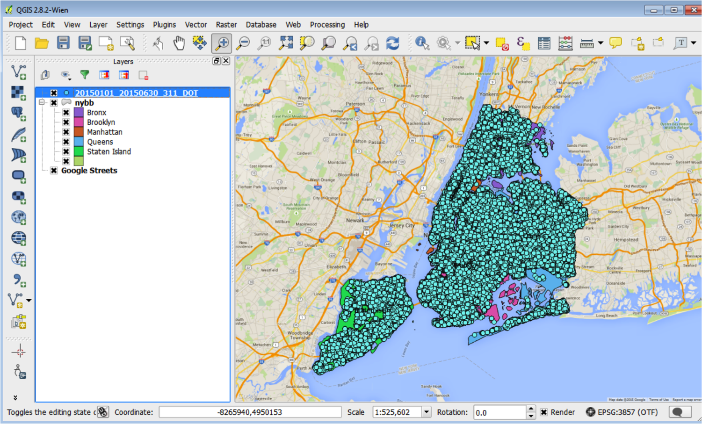
Source: [NYC Open Data Portal 311 Service Requests](https://data.cityofnewyork.us/Social-Services/311-Service-Requests-from-2010-to-Present/erm2-nwe9), DOT Responsible Agency 1 January - 30 June 2015

---

# [CARTO](https://carto.com/)
<iframe width="100%" height="480" frameborder="0" src="https://richard-datapolitan.carto.com/viz/c0d4f39e-962e-11e4-9b3b-0e9d821ea90d/embed_map" allowfullscreen webkitallowfullscreen mozallowfullscreen oallowfullscreen msallowfullscreen></iframe>

<!--  -->

---

# Disclaimer
--

## I'm a [CARTO Partner](https://carto.com/partners/)
--

## But this isn't a sales session, merely an opportunity to share the technology with Columbia students

---
# Assumptions
--

+ You all like maps, particularly old maps, and would like to work with them in digital forms
--

+ You want to be able to add layers of interest to older maps
--

+ You like being able to easily share your maps with others

---

[](http://chriswhong.com/open-data/in-search-of-hess-triangle-part-1/)

---

class:center,middle
# Let's Map This in CARTO

---

class: middle

# DISCLAIMER

##&nbsp;

##&nbsp;

---

class: middle

# DISCLAIMER

## CARTO has made a lot of changes to their tool

##&nbsp;

---

class: middle

# DISCLAIMER

## CARTO has made a lot of changes to their tool

## So this will be a co-exploration

---

# 0. Getting Set-up
+ Go to http://columbialibraries.carto.com/signup (use an alias if there's already an account with your name)
+ Register for an account with your `columbia.edu` account

---

# 1. Get current tax lots for area

<a href="http://chriswhong.github.io/plutoplus/#" target="_blank">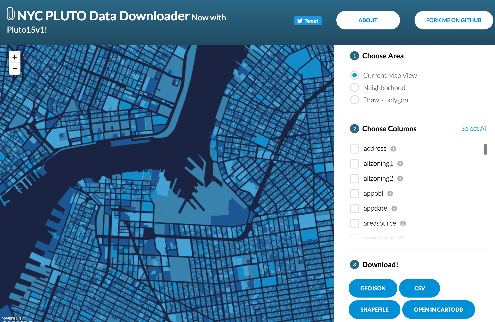</a>

---

# 1. Get current tax lots for area
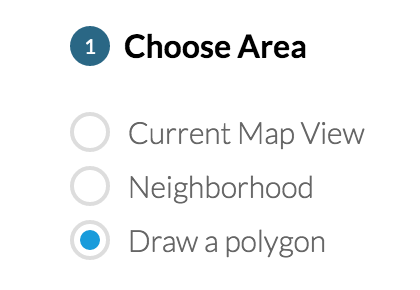

---

# 1. Get current tax lots for area


---

class:center
# Data Formats - CSV


---

class:center
# Data Formats - JSON


---

class:center
# Data Formats - GeoJSON


For more information see Eric Brelsford's [GeoJSON and Github tutorial](http://youtu.be/TQs7fYo9d_M)

---

class:center
# Data Formats - XML/KML


---

# 1. Get current tax lots for area
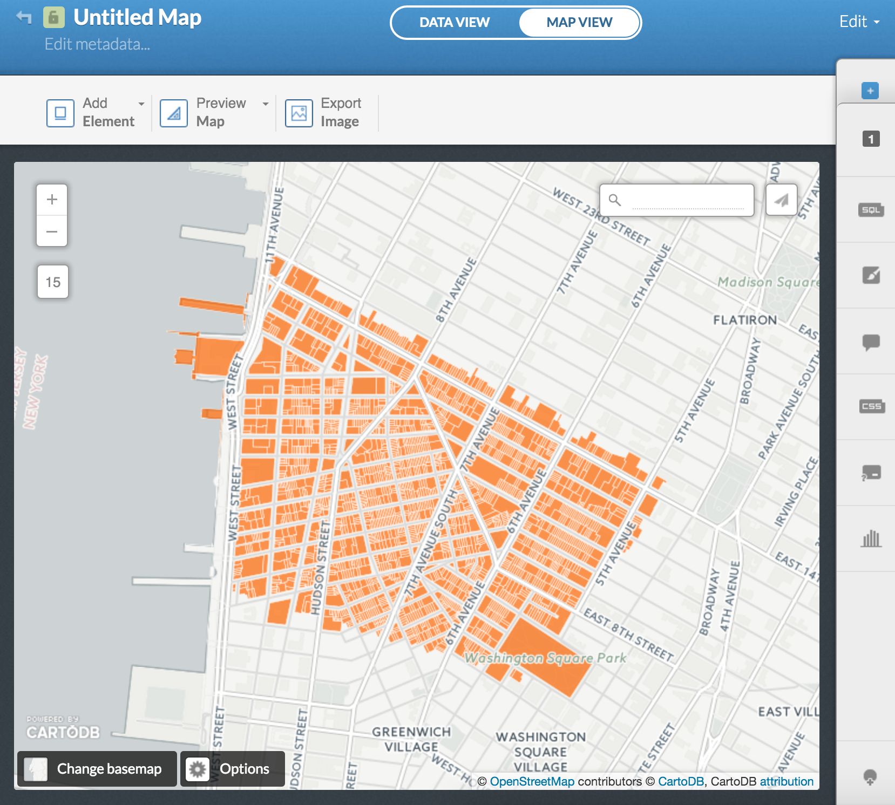

---

# 2. Get an historical map
[](http://maps.nypl.org/warper/)

---

# 2. Get an historical map
[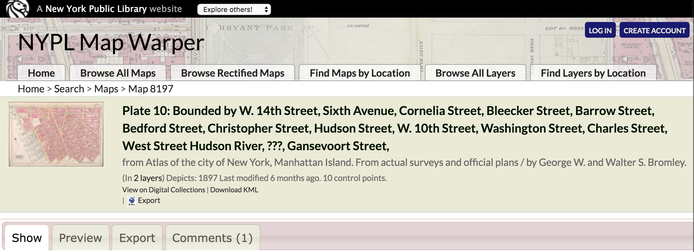](http://maps.nypl.org/warper/maps/8197)

###http://maps.nypl.org/warper/maps/8197

--

## Click on the Export tab

---

# 2. Get an historical map


--

## Copy this link
---

# 3. Add map to CARTO

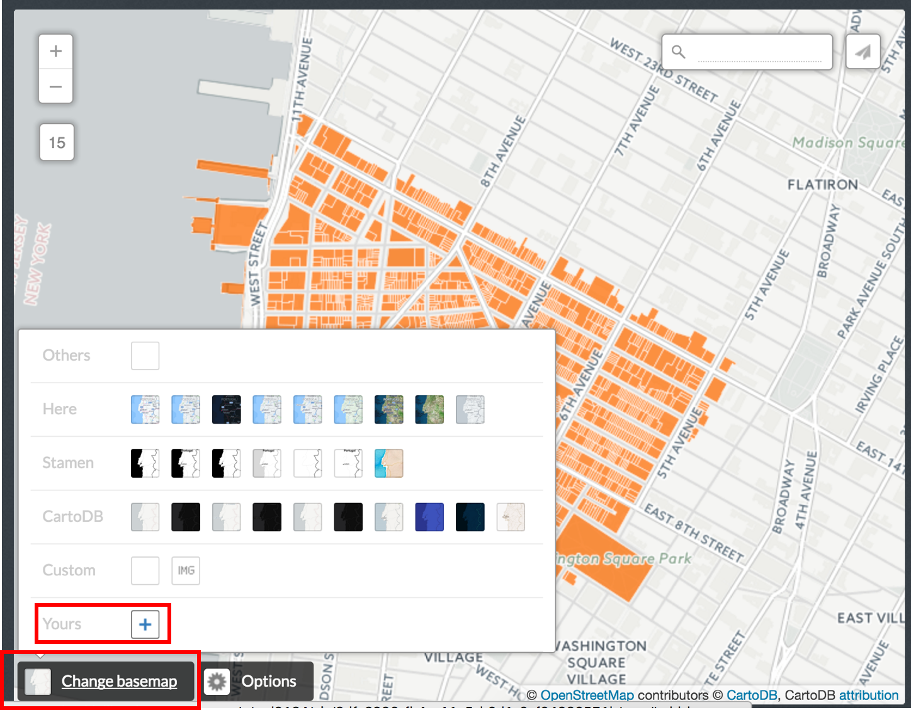

---

# 3. Add map to CARTO
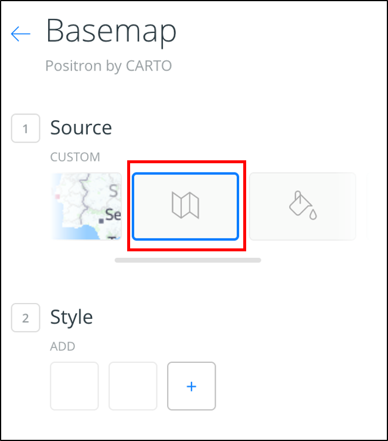
--
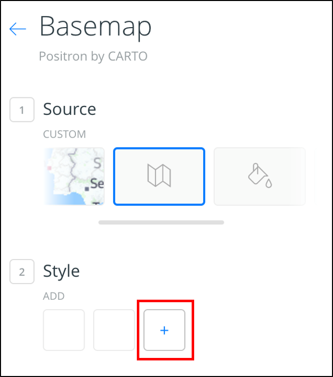

---

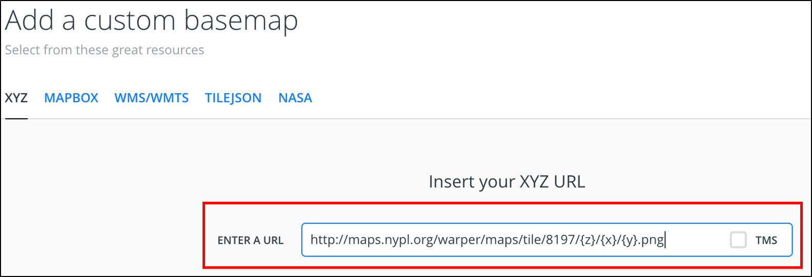
--


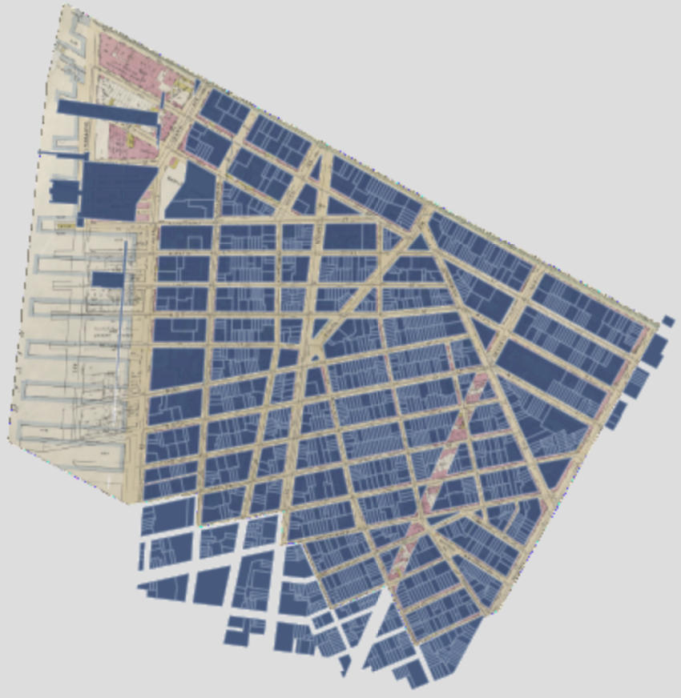
---

# 4. Style and add layers
+ [Subway routes](data/nyct_subway_routes_20150914.zip)
+ [Subway stations](data/nyct_subway_stations_20150914.zip)
+ Borough outlines (CARTO already has these in their data library, search for `ny_boroughs`)

---

# Styling the subway routes
```css
#nyctsubwayroutes_20150914 {
/*  line-cap: round;
  line-dasharray: 10, 4;*/
   line-width: 2;
   line-opacity: 1;
}

#nyctsubwayroutes_20150914[route_id="F"],
#nyctsubwayroutes_20150914[route_id="D"],
#nyctsubwayroutes_20150914[route_id="B"],
#nyctsubwayroutes_20150914[route_id="M"]{
   line-color: #FFA300;
}
#nyctsubwayroutes_20150914[route_id="1"],
#nyctsubwayroutes_20150914[route_id="3"],
#nyctsubwayroutes_20150914[route_id="2"] {
   line-color: #f70a0c;
}
#nyctsubwayroutes_20150914[route_id="R"],
#nyctsubwayroutes_20150914[route_id="N"],
#nyctsubwayroutes_20150914[route_id="Q"] {
   line-color: #FFCC00;
}
```

---

```css
#nyctsubwayroutes_20150914[route_id="4"],
#nyctsubwayroutes_20150914[route_id="6"],
#nyctsubwayroutes_20150914[route_id="5"] {
   line-color: #229A00;
}
#nyctsubwayroutes_20150914[route_id="A"],
#nyctsubwayroutes_20150914[route_id="C"],
#nyctsubwayroutes_20150914[route_id="E"],
#nyctsubwayroutes_20150914[route_id="H"] {
   line-color: #3E7BB6;
}
#nyctsubwayroutes_20150914[route_id="L"],
#nyctsubwayroutes_20150914[route_id="FS"],
#nyctsubwayroutes_20150914[route_id="S"] {
   line-color: #848484;
}
#nyctsubwayroutes_20150914[route_id="G"] {
  line-color:#2EFE2E;
}
#nyctsubwayroutes_20150914[route_id="J"],
#nyctsubwayroutes_20150914[route_id="Z"] {
  line-color: #996600;
}
#nyctsubwayroutes_20150914[route_id="7"]{
  line-color: #A53ED5;
}
#nyctsubwayroutes_20150914[route_id="Air"]{
    line-opacity: 0;
}
```

---

class:center,middle
<!-- <iframe width="100%" height="480" frameborder="0" src="https://columbialibraries.CARTO.
com/u/rad2184/viz/8dfa8996-fb4c-11e5-b2d1-0ef24382571b/embed_map" allowfullscreen webkitallowfullscreen mozallowfullscreen oallowfullscreen msallowfullscreen></iframe> -->
<iframe width="100%" height="480" frameborder="0" src="https://columbialibraries.carto.com/u/rad2184/builder/d25c7c5a-197f-11e7-926f-0ef24382571b/embed" allowfullscreen webkitallowfullscreen mozallowfullscreen oallowfullscreen msallowfullscreen></iframe>

---

class:center,middle


---

# Get Projection from a .prj file
[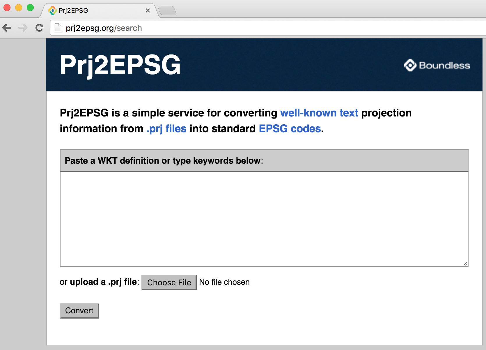](http://prj2epsg.org/search)

---

class:middle
[](https://carto.com/blog/qgis-plugin/)

---

class:center,middle
# Try doing that in ArcGIS...


---

# For more information:
+ QGIS: http://www.qgis.org/en/docs/index.html
+ CARTO: https://carto.com/academy
+ My data analytics classes and mapping: http://training.datapolitan.com

---

# Thank You
+ [richard@datapolitan.com](mailto:richard[at]datapolitan[dot]com)
+ http://blog.datapolitan.com
+ [@datapolitan](https://twitter.com/Datapolitan)