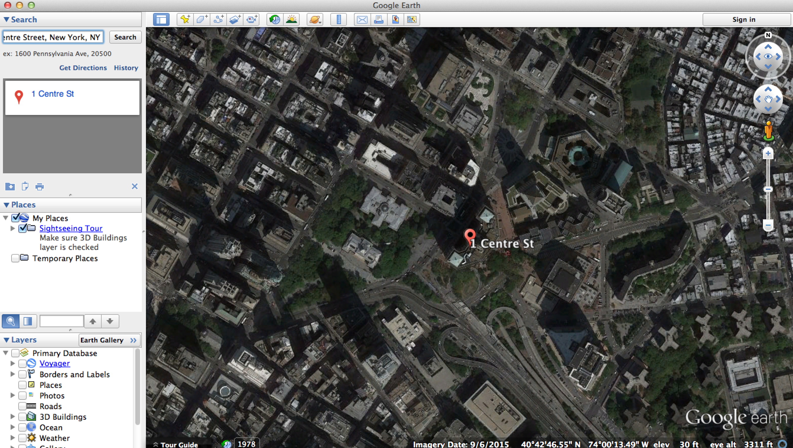
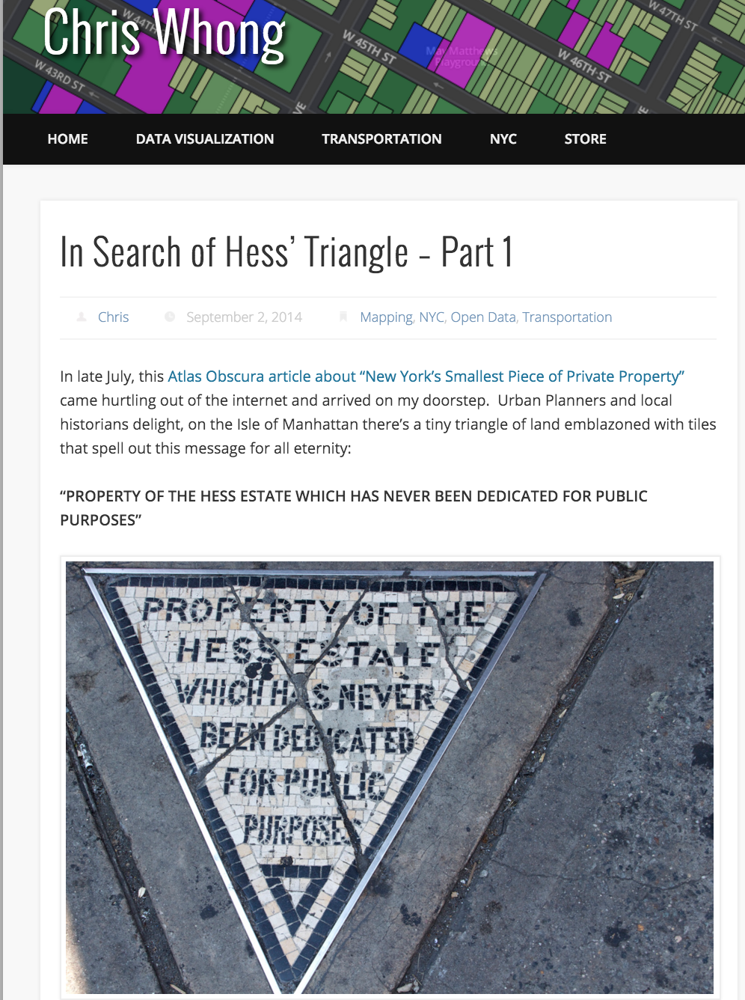
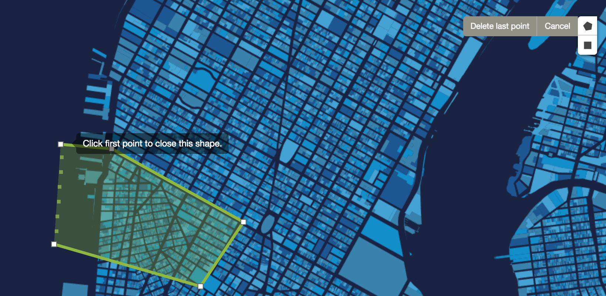
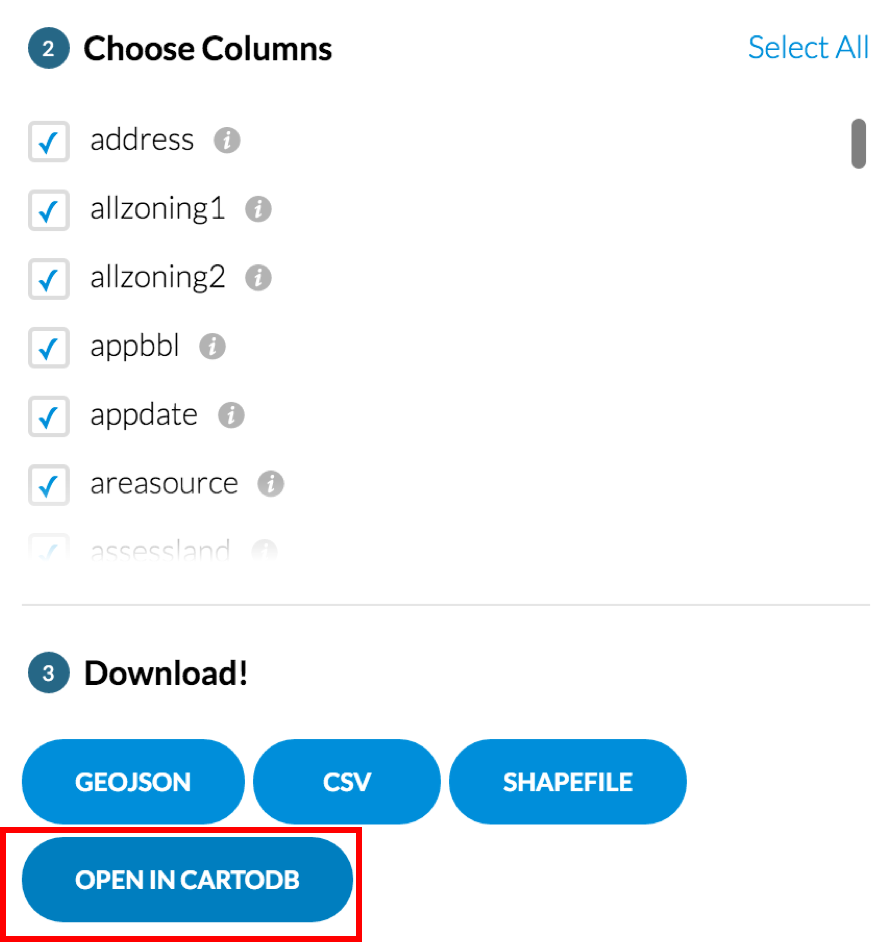
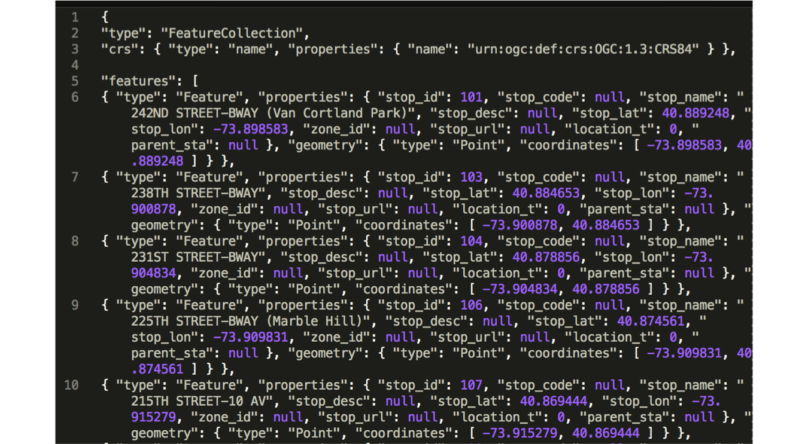
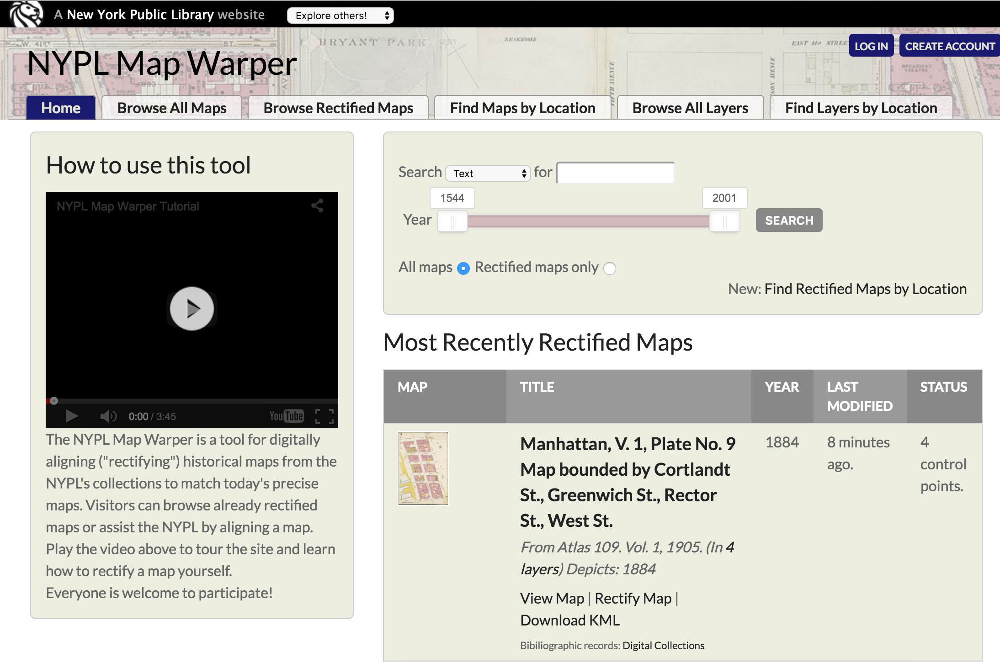
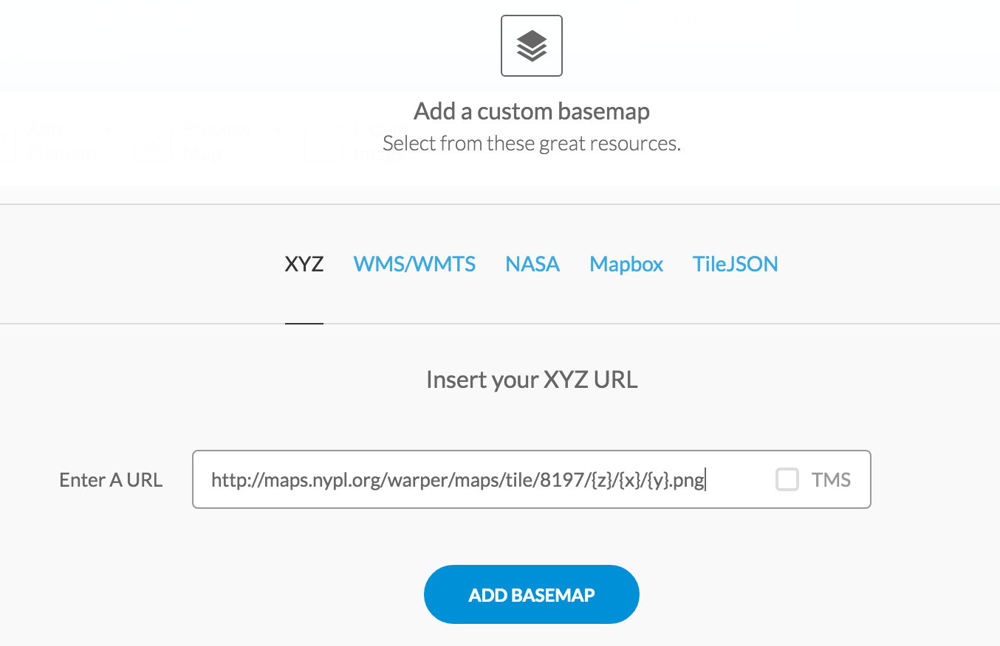
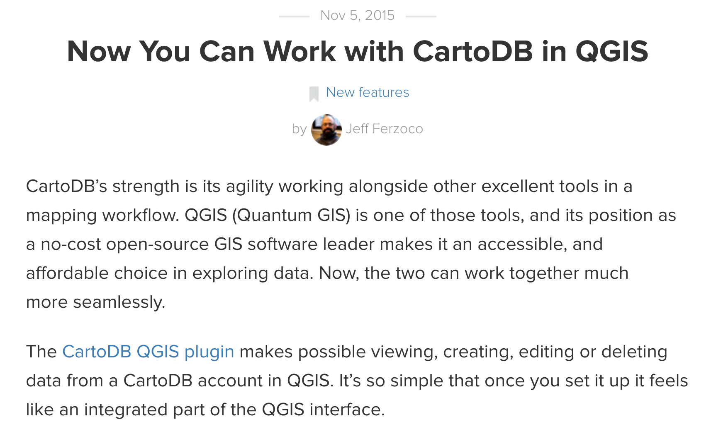

layout:true

Web Mapping for Preservationists by <a xmlns:cc="http://creativecommons.org/ns#" href="http://www.datapolitan.com" property="cc:attributionName" rel="cc:attributionURL">Richard Dunks</a> is licensed under a <a rel="license" href="http://creativecommons.org/licenses/by-nc-sa/4.0/">Creative Commons Attribution-NonCommercial-ShareAlike 4.0 International License</a>.

---

class: center

- - -
# Web Mapping for Preservationists
## Richard Dunks
## Follow along at: https://data-guest-lectures.github.io/web-mapping-for-preservationists/ 

---

# Introductions
+ Name
+ Concentation
+ One thing you hope to get out of the lecture tonight

---

# Goals for this evening
--

+ Quickly review of different types of maps and discuss their use
--

+ Provide a survey of common mapping tools
--

+ Discuss the difference between open-source and proprietary software as it relates to GIS and mapping
--

+ Practice using an online, interactive webmapping service (CartoDB) to create a simple interactive historical(-ish) map using open data

---

class: center, middle
# Why Do We Create Maps?

---

# Thematic Maps

--

+ Focuses on a specific theme or subject area
--

+ Features on the map represent the phenomenon being mapped
--

+ Spatial features used for reference
---

##### Source: http://www.usna.usda.gov/Hardzone/ushzmap.html 

---

# Dorling Cartogram – Obesity by State

##### Source: http://homes.cs.washington.edu/~jheer//files/zoo/ 

---

# General Reference Maps

--

+ Show important physical features of an area
--

+ Include natural and man-made features
--

+ Usually meant to help aid in the navigation or discovery of locations
--

+ Usually fairly simple
--

+ Can be stylized based on the intended audience (tourists vs locals)

---

---

# The Tools

---

# ArcGIS

[Source](http://www.esri.com/news/arcuser/1012/a-workflow-for-creating-and-sharing-maps.html)

---

# Google Earth

---

# Google Fusion Tables
<iframe width="100%" height="430" scrolling="no" frameborder="no" src="https://www.google.com/fusiontables/embedviz?q=select+col54%2C+col55+from+1dNtdy7FuBBZ2qTxX7jgZ5Dig8n96oxRrWFjuhYpJ+where+col3+%3E%3D+0+and+col3+%3C%3D+4+and+col26+%3D+2+limit+1000&amp;viz=HEATMAP&amp;h=true&amp;lat=40.844685&amp;lng=-73.915349&amp;t=1&amp;z=12&amp;l=col54&amp;y=2&amp;tmplt=2&amp;hmd=true&amp;hmg=%2366ff0000%2C%2393ff00ff%2C%23c1ff00ff%2C%23eeff00ff%2C%23f4e300ff%2C%23f4e300ff%2C%23f9c600ff%2C%23ffaa00ff%2C%23ff7100ff%2C%23ff3900ff%2C%23ff0000ff&amp;hmo=0.6&amp;hmr=26&amp;hmw=0&amp;hml=TWO_COL_LAT_LNG"></iframe>
Source: [NYC Open Data 311 Noise Complaints, 1 Jan - 20 May 2014, Between Midnight and 4 am in the Bronx](https://www.google.com/fusiontables/DataSource?docid=1dNtdy7FuBBZ2qTxX7jgZ5Dig8n96oxRrWFjuhYpJ# map:id=3)

---

# Proprietary vs Open Source Software

--

+ Proprietary software source code is owned by an individual or an organization and tightly restricted (usually for profit)
--

+ Open source software source code is freely available to anyone for download, alteration, and republishing

---

# Proprietary vs Open Source Software

--

+ Proprietary software code is generally supported by a team of paid professionals working for the organization that owns the code
--

+ Open source software code is generally supported by a mix of paid and volunteer professionals that contribute changes back to the community
---

# Proprietary vs Open Source Software

--

+ Proprietary software is often available only by purchasing a license
--

+ Open source software is free to use though there generally a license that specifies the restrictions (if any) on its use and reuse
--

+ Companies using open source software may charge for the use of the software through their proprietary implementations or via their infrastructure

---

class:center,middle
# Examples of Open Source Mapping Software

---

# [QGIS](http://www.qgis.org/)

Source: [NYC Open Data Portal 311 Service Requests](https://data.cityofnewyork.us/Social-Services/311-Service-Requests-from-2010-to-Present/erm2-nwe9), DOT Responsible Agency 1 January - 30 June 2015

---

# [CartoDB](https://cartodb.com/)
<iframe width="100%" height="480" frameborder="0" src="https://richard-datapolitan.cartodb.com/viz/c0d4f39e-962e-11e4-9b3b-0e9d821ea90d/embed_map" allowfullscreen webkitallowfullscreen mozallowfullscreen oallowfullscreen msallowfullscreen></iframe>

<!--  -->

---

# Disclaimer
--

## I'm a [CartoDB Partner](https://cartodb.com/partners/)
--

## But this isn't a sales session, merely an opportunity to share the technology with Columbia students

---
# Assumptions
--

+ You all like maps, particularly old maps, and would like to work with them in digital forms
--

+ You want to be able to add layers of interest to older maps
--

+ You like being able to easily share your maps with others

---

---

class:center,middle
# Let's Map This in CartoDB
---

#0. Getting Set-up
+ Go to http://columbialibraries.cartodb.com/signup (use an alias if there's already an account with your name)
+ Register for an account with your `columbia.edu` account

---

#1. Get current tax lots for area

---

#1. Get current tax lots for area

---

#1. Get current tax lots for area

---

class:center
# Data Formats - CSV

---

class:center
# Data Formats - JSON

---

class:center
# Data Formats - GeoJSON

For more information see Eric Brelsford's [GeoJSON and Github tutorial](http://youtu.be/TQs7fYo9d_M)

---

class:center
# Data Formats - XML/KML

---

#1. Get current tax lots for area

---

#2. Get a historical map

---

#2. Get a historical map

### http://maps.nypl.org/warper/maps/8197

--

## Click on the Export tab

---

#2. Get a historical map

--

## Copy this link
---

#3. Add map to CartoDB

---

#3. Add map to CartoDB

---

#4. Style and add layers
+ [Subway routes](data/nyct_subway_routes_20150914.zip)
+ [Subway stations](data/nyct_subway_stations_20150914.zip)
+ Borough outlines (CartoDB already has these in their data library)

---

class:center,middle
<iframe width="100%" height="480" frameborder="0" src="https://columbialibraries.cartodb.
com/u/rad2184/viz/8dfa8996-fb4c-11e5-b2d1-0ef24382571b/embed_map" allowfullscreen webkitallowfullscreen mozallowfullscreen oallowfullscreen msallowfullscreen></iframe>

---

class:center,middle

---

# Get Projection from a .prj file

---

class:middle

---

class:center,middle
# Try doing that in ArcGIS...

---

# For more information:
+ QGIS: http://www.qgis.org/en/docs/index.html
+ CartoDB: http://academy.cartodb.com/
+ My data analytics classes and mapping: https://github.com/datapolitan/Data_Analytics_Classes

---

# Thank You
+ [richard@datapolitan.com](mailto:richard@datapolitan.com)
+ http://blog.datapolitan.com
+ [@rdunks1](https://twitter.com/rdunks1)/[@datapolitan](https://twitter.com/Datapolitan)
